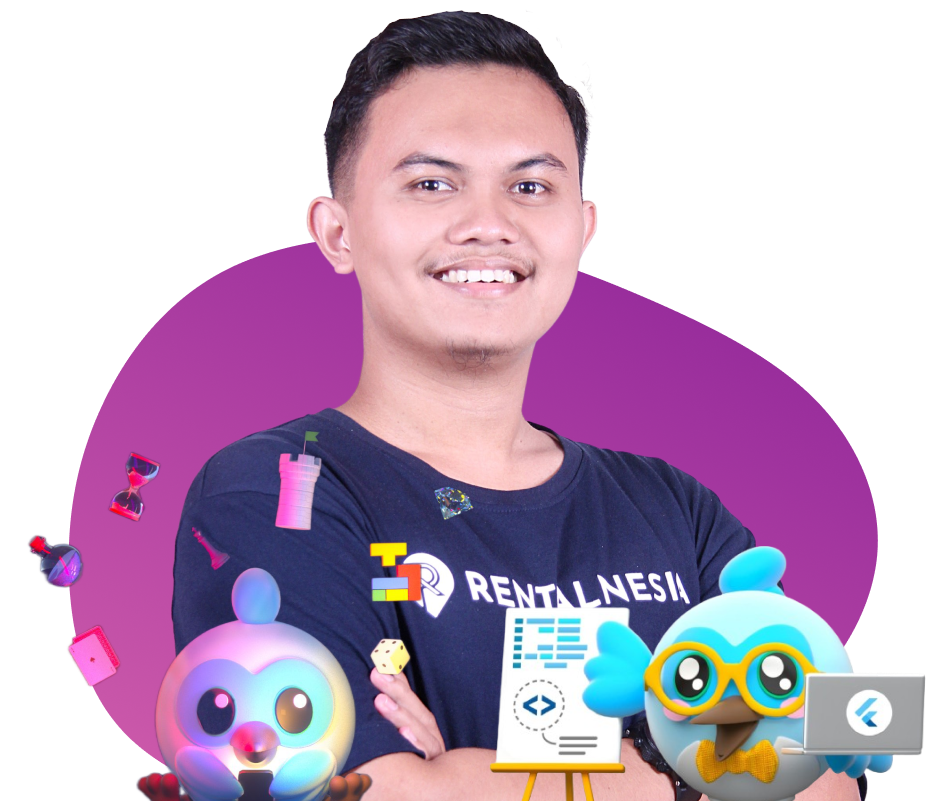

## Sedikit Tentang Saya

Halo! 👋 **Saya Utrodus Said Al Baqi**, seorang software engineer yang memiliki passion dalam membangun aplikasi yang indah dan ramah pengguna menggunakan **Dart** dan **Flutter**.

Baik itu untuk Android, iOS, atau web, saya berfokus menciptakan aplikasi yang tidak hanya tampak menarik tetapi juga **mempermudah kehidupan pengguna**.

> Setiap proyek yang saya kerjakan adalah **kesempatan** untuk menciptakan teknologi yang memberikan **dampak positif**, dengan menggabungkan keterampilan teknis dan desain yang indah, menghasilkan sesuatu yang **fungsional** dan **menawan secara visual**.

Berasal dari **Blitar, Indonesia**, saya saat ini **bekerja secara remote** 👨‍💻. Hal ini memberi saya fleksibilitas untuk memberikan hasil berkualitas tinggi, baik untuk pekerjaan **penuh waktu** maupun proyek **freelance**.

Saya adalah orang yang **pekerja keras**, **berorientasi pada tujuan**, dan selalu **penasaran** dengan teknologi baru. Saya senang mendalami riset dan eksperimen saat sesuatu menarik perhatian saya, terus belajar dan berkembang seiring berjalannya waktu.

Meskipun terkadang saya **perfeksionis**, saya telah menemukan keseimbangan dengan fokus menyelesaikan pekerjaan terlebih dahulu, lalu menyempurnakannya sesuai kebutuhan.


Mari ciptakan sesuatu yang hebat bersama!



## My Skills


- **Proficient:** ```Dart```, ```Flutter```, ```State Management (BLoC, Provider, GetX, setState, Inherited Widget)```, ```Stacked Framework```, ```Architecture Patterns (Clean Architecture, MVVM, BLoC Pattern)```, ```Design Pattern```, ```Clean Code```, ```RESTful API Integration```, ```Responsive Design```, ```Flutter Animation```, ```Flutter Dev Tools```, ```Firebase```, ```Unit Testing```, ```Widget Testing```, ```Git```, ```Github```, ```Cross-platform app development```, ```Flutter Flow```

- **Familiar:** ```Integration Testing```, ```Continuous Integration```, ```Continuous Deployment```, ```Research and Development```, ```Technical Documentation```, ```Java```, ```Python```, ```Fast API```, ```Agile Development```, ```Project Management (Jira, Trello)```

## Pengalaman Kerja

-  **Freelance Flutter Developer** - *Multiple Clients*, ```Jan 2021 - Present```
-  **Freelance Flutter Engineer** - *PT Rekeningku Dotcom Indonesia*, ```Jan 2024 - Mar 2024 · 3 mos```
-  **Middle Flutter Developer & Flutter Engineer** - *PT Glovory Technologies Indonesia*, ```Oct 2022 - Mar 2023 · 6 mos``` 
-  **Flutter Developer** - *Ediide Infografika*, ```Apr 2018 - Mar 2021 · 3 yrs```

## Education

**[Universitas Nahdlatul Ulama Blitar](https://unublitar.ac.id/)**  
*2018 - 2023*  
**Major:** Computer Science  
**Grade:** 3.76

### Relevant Coursework
Pengantar Logika & Pemrograman, Algoritma & Struktur Data, Pemrograman Berorientasi Objek, Java, Basis Data, Rekayasa Perangkat Lunak, Interaksi Manusia-Komputer, Pengembangan Aplikasi Mobile, Kecerdasan Buatan

### Final Year Project
Mengembangkan aplikasi pencarian ayat Quran dengan fokus pada pendekatan pencarian leksikal, semantik, dan gabungan. Proyek ini dibangun menggunakan Dart, Flutter, Python, dan FastAPI.

  
## Perjalanan Saya

- 🔭 Currently focused in Cross-Platform App Development, I am working on projects that span Android, iOS, and Web.  
- 🌱 Perjalanan pembelajaran saya yang sedang berlangsung ialah mendalami Backend Development.
- 🤓 Saya memiliki kegemaran untuk melakukan penelitian mini atau investigasi terhadap hal-hal yang menarik minat saya, terutama dalam bidang Pengembangan Aplikasi Multi-Platform.
- 🗿 Fakta Menarik: Sebagai pengadopsi awal Dart & Flutter, saya telah mengeksplorasi kemampuannya selama lebih dari tiga tahun.


## Personal Interests
> Di luar pekerjaan, saya menikmati menjelajahi teknologi baru melalui penelitian dan bersantai dengan bermain game di PC atau PlayStation. 
> 
> Kegiatan-kegiatan ini tidak hanya membantu saya menjaga gaya hidup yang seimbang tetapi juga membawa perspektif dan inspirasi baru ke dalam usaha profesional saya.

