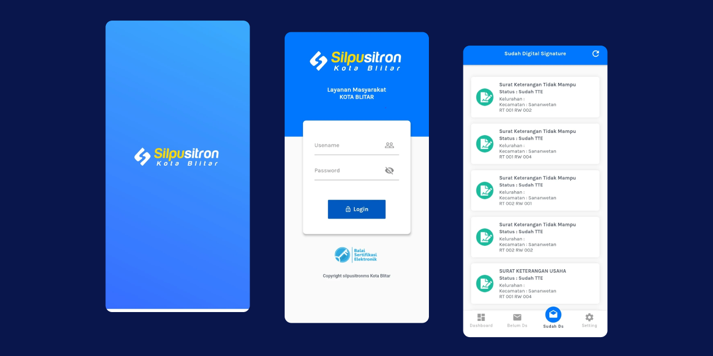
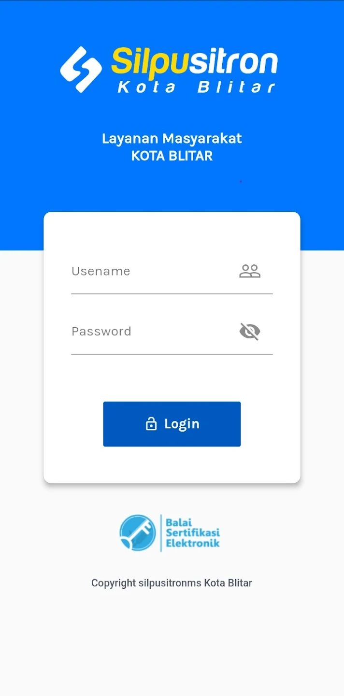
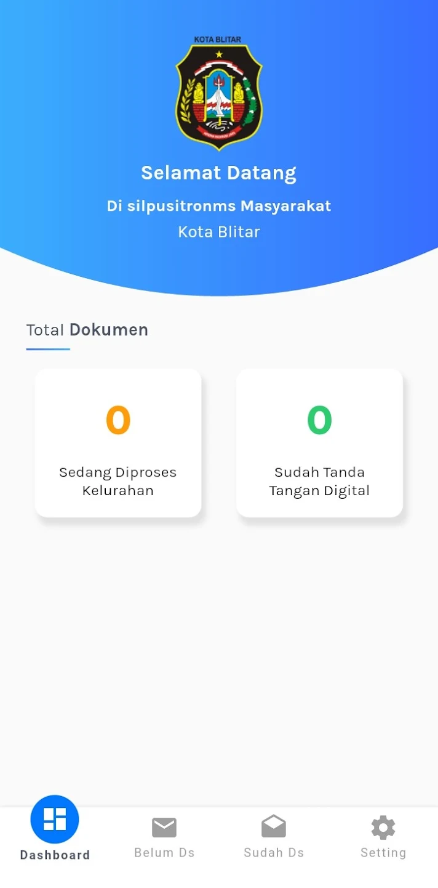
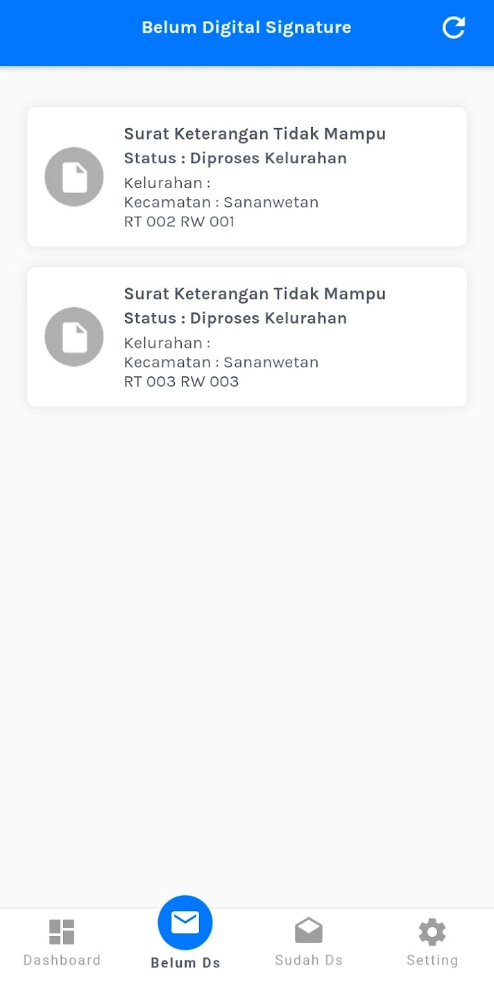
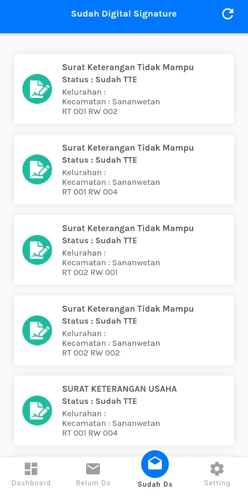

## Overview

<table class="table-auto text-left text-base min-w-full">
    <tbody>
      <tr class="border-b py-2">
        <th scope="row" class="font-bold">Client</th>
        <td class="font-bold">:</td>
        <td class="py-2">Robait Usman - CV Ediide Infografika (Vendor)</td>
      </tr>
      <tr class="border-b py-2">
        <td class="font-bold">Durasi</td>
        <td class="font-bold">:</td>
        <td class="py-2">2 Minggu</td>
      </tr>
      <tr class="border-b py-2">
        <td class="font-bold">Tahun</td>
        <td class="font-bold">:</td>
        <td class="py-2">2019</td>
      </tr>
      <tr class="border-b py-2">
        <td class="font-bold">Jasa</td>
        <td class="font-bold">:</td>
        <td class="py-2">
          Mobile Development
          </td>
      </tr>
      <tr class="border-b py-2">
        <td class="font-bold">Platform</td>
        <td class="font-bold">:</td>
        <td class="py-2">
          Android
          </td>
      </tr>        
      <tr class="border-b py-2">
        <td class="font-bold">Tech Stacks</td>
        <td class="font-bold">:</td>
        <td class="py-2">
          Dart, Flutter, Drupal
          </td>
      </tr>        
    </tbody>
  </table>

SILPUSITRON (Electronically Integrated Public Service Information System) Layanan Kecamatan adalah aplikasi yang digunakan oleh petugas layanan di kecamatan untuk memberikan layanan surat kepada masyarakat.

Aplikasi SILPUSITRON juga dirancang untuk memudahkan layanan administrasi di desa dan kecamatan. Tugas administrasi dan aplikasi untuk administrasi dalam kecamatan atau antara Organisasi Perangkat Daerah (OPD) dapat diselesaikan melalui smartphone.

Masyarakat hanya perlu mengajukan permintaan dan mengunggah lampiran surat yang diperlukan.

## Screenshots

  
  
  
  
  


## Fitur Aplikasi:
### Home
- **Description:** Menampilkan total dokumen yang belum ditandatangani secara digital dan yang telah ditandatangani.
- **Function:** Memberikan gambaran cepat kepada petugas tentang jumlah pekerjaan yang perlu diselesaikan terkait dokumen digital.

### Belum DS (Digital Signature)
- **Description:** Menampilkan daftar dokumen yang belum ditandatangani secara digital.
- **Function:** Membantu pengguna mengidentifikasi dan menyelesaikan dokumen yang masih memerlukan tanda tangan digital, memastikan proses administrasi berjalan lancar.
  
### Sudah DS (Digital Signature)
- **Description:** Menampilkan daftar dokumen yang telah ditandatangani secara digital.
- **Function:** Memberikan informasi kepada pengguna tentang dokumen yang telah menyelesaikan proses tanda tangan digital, memfasilitasi pelacakan dan pengarsipan.
  

## Live Preview

