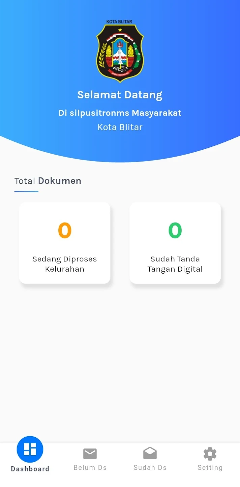
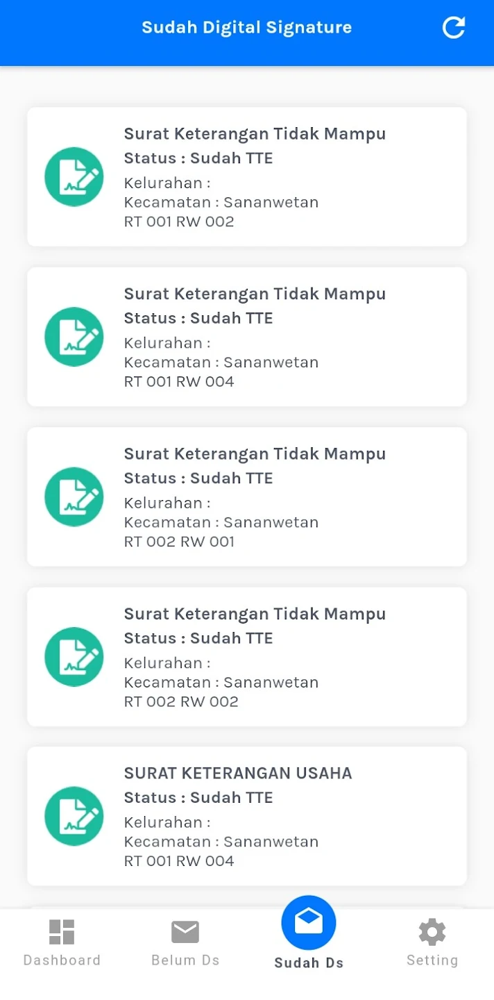

## Overview

<table class="table-auto text-left text-base min-w-full">
    <tbody>
      <tr class="border-b py-2">
        <th scope="row" class="font-bold">Client</th>
        <td class="font-bold">:</td>
        <td class="py-2">Robait Usman - CV Ediide Infografika (Vendor)</td>
      </tr>
      <tr class="border-b py-2">
        <td class="font-bold">Duration</td>
        <td class="font-bold">:</td>
        <td class="py-2">2 Week</td>
      </tr>
      <tr class="border-b py-2">
        <td class="font-bold">Year</td>
        <td class="font-bold">:</td>
        <td class="py-2">2019</td>
      </tr>
      <tr class="border-b py-2">
        <td class="font-bold">Services</td>
        <td class="font-bold">:</td>
        <td class="py-2">
          Mobile Development
          </td>
      </tr>
      <tr class="border-b py-2">
        <td class="font-bold">Platform</td>
        <td class="font-bold">:</td>
        <td class="py-2">
          Android
          </td>
      </tr>        
      <tr class="border-b py-2">
        <td class="font-bold">Tech Stacks</td>
        <td class="font-bold">:</td>
        <td class="py-2">
          Dart, Flutter, Drupal
          </td>
      </tr>        
    </tbody>
  </table>
  
SILPUSITRON (Electronically Integrated Public Service Information System) Sub-District Service is an application used by service officers in sub-districts to provide mail services to the community.

The SILPUSITRON application is also designed to facilitate administrative services in villages and sub-districts. Administrative tasks and applications for administration within sub-districts or between Regional Device Organizations (RDOs) can be completed via a smartphone. 

The public only needs to request and upload the required letter attachments.

## Screenshots

  
  
  
  
  


## App Features:
### Home
- **Description:** Displays the total documents that have not yet been digitally signed and those that have been signed.
- **Function:** Provides a quick overview to officers about the amount of work that needs to be completed related to digital documents.
### Belum DS (Digital Signature)
- **Description:** Displays a list of documents that have not yet been digitally signed.
- **Function:** Helps users identify and complete documents that still need a digital signature, ensuring smooth administrative processes.
  
### Sudah DS (Digital Signature)
- **Description:** Displays a list of documents that have been digitally signed.
- **Function:** Provides information to users about documents that have completed the digital signing process, facilitating tracking and archiving.
  

## 🔗 Link to Project

Live Demo

