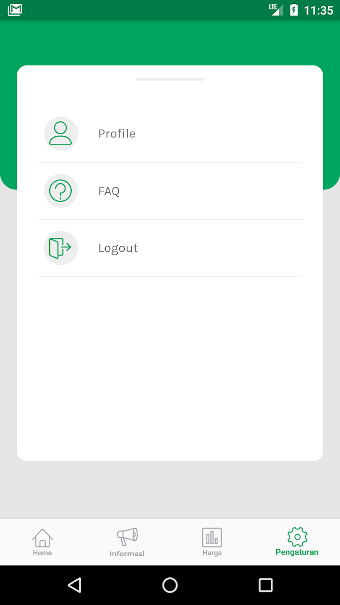

## Overview

<table class="table-auto text-left text-base min-w-full">
    <tbody>
      <tr class="border-b py-2">
        <th scope="row" class="font-bold">Client</th>
        <td class="font-bold">:</td>
        <td class="py-2">Robait Usman - CV Ediide Infografika (Vendor)</td>
      </tr>
      <tr class="border-b py-2">
        <td class="font-bold">Durasi</td>
        <td class="font-bold">:</td>
        <td class="py-2">5 Bulan</td>
      </tr>
      <tr class="border-b py-2">
        <td class="font-bold">Tahun</td>
        <td class="font-bold">:</td>
        <td class="py-2">2019</td>
      </tr>
      <tr class="border-b py-2">
        <td class="font-bold">Jasa</td>
        <td class="font-bold">:</td>
        <td class="py-2">
          Mobile Development
          </td>
      </tr>
      <tr class="border-b py-2">
        <td class="font-bold">Platform</td>
        <td class="font-bold">:</td>
        <td class="py-2">
          Android
          </td>
      </tr>        
      <tr class="border-b py-2">
        <td class="font-bold">Tech Stacks</td>
        <td class="font-bold">:</td>
        <td class="py-2">
          Dart, Flutter, Drupal
          </td>
      </tr>        
    </tbody>
  </table>

E-Tani Blitar (Enterprise Pertanian Kabupaten Blitar) adalah aplikasi untuk kesejahteraan petani dan masyarakat di Kabupaten Blitar, dengan menyediakan informasi terbaru tentang harga pasar dan komoditas yang banyak ditanam.

Sehingga, petani dapat memprediksi komoditas yang dapat memberikan banyak manfaat. Masyarakat juga dapat mengetahui harga komoditas mulai dari Harga Produsen (Harga Petani) hingga Harga Konsumen (Harga Pasar).

Aplikasi ini juga memiliki fitur pengumpulan data tentang harga produsen, harga konsumen, penambahan area tanam, pemanfaatan kelompok tani, dan alat pertanian.

## Screenshots

  
  
  
  
  
  
  


## Fitur Aplikasi:
### Home
- **Description:** Halaman utama aplikasi yang menampilkan ringkasan informasi terkini tentang harga komoditas dan berita terbaru terkait pertanian serta Menampilkan Menu untuk navigasi ke fitur-fitur utama yaitu, verifikasi poktan, input harga konsumen, input harga produsen, luas tambah tanam, tambah alsintan, info harga
- **Function:** Menyediakan akses cepat ke fitur-fitur utama aplikasi lainnya, sehingga pengguna dapat dengan mudah menavigasi dan mendapatkan informasi yang dibutuhkan.

### Verifikasi Poktan
- **Description:** Proses untuk memastikan bahwa kelompok tani (poktan) yang terdaftar adalah sah dan diakui oleh pihak berwenang.
- **Function:**  Memastikan bahwa hanya kelompok tani yang terdaftar telah terverifikasi guna meningkatkan keamanan dan kepercayaan dalam komunitas pertanian
  
### Input Harga Konsumen
- **Description:** Fitur untuk memasukkan data harga konsumen atau harga pasar dari berbagai komoditas pertanian.
- **Function:** Memungkinkan pengguna untuk mencatat dan memperbarui harga komoditas yang dijual di pasar, memberikan data harga yang akurat dan terkini kepada petani dan masyarakat.

### Input Harga Produsen
- **Description:** Fitur untuk memasukkan data harga produsen atau harga dari petani untuk berbagai komoditas pertanian.
- **Function:** Memungkinkan petani untuk mencatat dan memperbarui harga jual komoditas mereka, sehingga aplikasi dapat menampilkan perbandingan harga antara produsen dan konsumen. 
  
### Luas Tambah Tanam
- **Description:** Fitur untuk mencatat dan mengelola luas lahan tambahan yang digunakan untuk penanaman.
- **Function:** Membantu petani dalam mencatat luas lahan yang digunakan untuk menanam komoditas baru atau tambahan, memungkinkan analisis produktivitas lahan dan perencanaan penanaman yang lebih baik.

### Tambah Alsintan
- **Description:** Fitur untuk mencatat dan mengelola alat dan mesin pertanian (alsintan) yang digunakan oleh petani.
- **Function:** Memungkinkan petani untuk menambahkan dan memperbarui informasi tentang alsintan yang mereka miliki atau gunakan, membantu dalam pemantauan dan pengelolaan peralatan pertanian untuk meningkatkan efisiensi.
  
### Informasi
- **Description:** Menyediakan informasi detail tentang komoditas yang banyak ditanam di Kabupaten Blitar, termasuk artikel dan berita yang relevan dengan dunia pertanian.
- **Function:** Mengedukasi petani dengan tips dan trik untuk meningkatkan hasil panen dan efisiensi pertanian. Menampilkan informasi terbaru yang dapat membantu petani membuat keputusan yang lebih baik.
  
### Harga
- **Description:** Mengelola preferensi pengguna, termasuk pengaturan notifikasi dan bahasa, serta menyediakan akses ke bantuan dan dukungan teknis.
- **Function:** Memungkinkan pengguna untuk mencari informasi harga spesifik dengan fitur pencarian. Menyajikan tren harga untuk membantu petani dalam perencanaan penjualan komoditas.
  
### Pengaturan
- **Description:** Mengelola preferensi pengguna, termasuk mengedit profil, serta menyediakan akses ke bantuan dan dukungan teknis.
- **Function:** Memungkinkan pengguna untuk mengelola akun dan informasi pribadi mereka dengan mudah. Mengatur preferensi agar pengalaman pengguna lebih sesuai dengan kebutuhan mereka.
  - Profile (Edit Profil): Mengedit informasi pribadi pengguna.
  - FAQ: Menyediakan jawaban atas pertanyaan yang sering diajukan tentang penggunaan aplikasi.
  - Logout: Memungkinkan pengguna untuk keluar dari akun mereka dengan aman.
  
## 🔗 Link to Project

Live Demo

