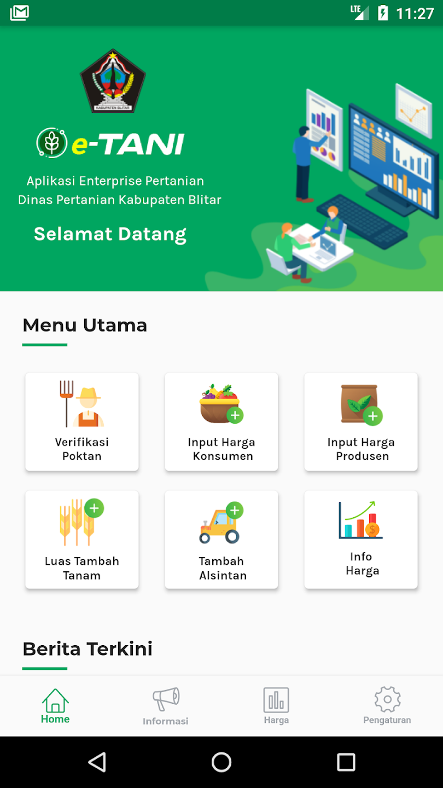
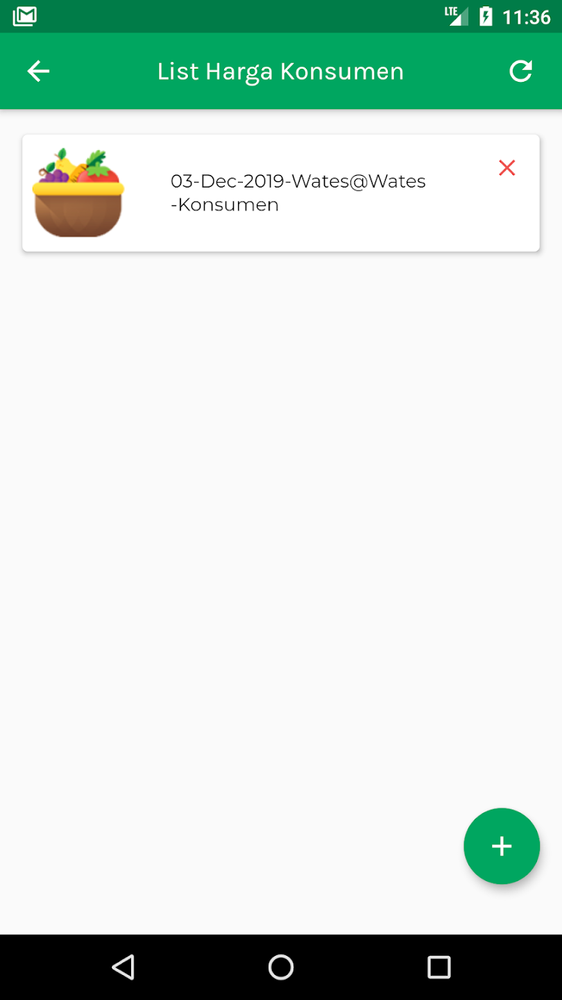

## Overview

<table class="table-auto text-left text-base min-w-full">
    <tbody>
      <tr class="border-b py-2">
        <th scope="row" class="font-bold">Client</th>
        <td class="font-bold">:</td>
        <td class="py-2">Robait Usman - CV Ediide Infografika (Vendor)</td>
      </tr>
      <tr class="border-b py-2">
        <td class="font-bold">Duration</td>
        <td class="font-bold">:</td>
        <td class="py-2">5 Month</td>
      </tr>
      <tr class="border-b py-2">
        <td class="font-bold">Year</td>
        <td class="font-bold">:</td>
        <td class="py-2">2019</td>
      </tr>
      <tr class="border-b py-2">
        <td class="font-bold">Services</td>
        <td class="font-bold">:</td>
        <td class="py-2">
          Mobile Development
          </td>
      </tr>
      <tr class="border-b py-2">
        <td class="font-bold">Platform</td>
        <td class="font-bold">:</td>
        <td class="py-2">
          Android
          </td>
      </tr>        
      <tr class="border-b py-2">
        <td class="font-bold">Tech Stacks</td>
        <td class="font-bold">:</td>
        <td class="py-2">
          Dart, Flutter, Drupal
          </td>
      </tr>        
    </tbody>
  </table>

E-Tani Blitar (Enterprise Pertanian Kabupaten Blitar ) Regency is an application for the welfare of farmers and communities in Blitar Regency, by providing the latest information about market prices and commodities that are widely planted,

So that farmers can predict commodities that can provide many benefits. The public can also find out the price of Commodities ranging from Producer Prices (Farmers Prices) to Consumer Prices (Market Prices).

It also features data collection on producer prices, consumer prices, additional planting area, leveraging farmer groups, and agricultural tools

## Screenshots

  
  
  
  
  
  
  


## App Features:
### Home
- **Description:** The main page of the application that displays a summary of the latest information about commodity prices and the latest news related to agriculture. It also displays a menu for navigation to the main features such as farmer group verification, consumer price input, producer price input, additional planting area, adding agricultural tools, and price information.
- **Function:** Provides quick access to other main features of the application, allowing users to easily navigate and obtain the needed information.

### Farmer Group Verification
- **Description:**  The process to ensure that registered farmer groups (poktan) are legitimate and recognized by the authorities.
- **Function:** Ensures that only registered farmer groups are verified to enhance security and trust within the agricultural community.
  
### Consumer Price Input (Input Harga Konsumen)
- **Description:** A feature to input consumer prices or market prices for various agricultural commodities.
- **Function:** Allows users to record and update the prices of commodities sold in the market, providing accurate and up-to-date price data to farmers and the community.

### Producer Price Input (Input Harga Produsen)
- **Description:** A feature to input producer prices or prices from farmers for various agricultural commodities.
- **Function:** Allows farmers to record and update the selling prices of their commodities, enabling the application to display price comparisons between producers and consumers.
  
### Additional Planting Area (Luas Tambah Tanam)
- **Description:** A feature to record and manage additional land area used for planting.
- **Function:**  Helps farmers record the land area used for planting new or additional commodities, enabling better analysis of land productivity and planting planning.

### Adding Agricultural Tools (Tambah Alsintan)
- **Description:** A feature to record and manage agricultural tools and machinery used by farmers.
- **Function:** Allows farmers to add and update information about the agricultural tools they own or use, helping in monitoring and managing agricultural equipment to improve efficiency.
  
### Information (Informasi)
- **Description:**  Provides detailed information about widely planted commodities in Blitar Regency, including articles and news relevant to the agricultural world.
- **Function:** Educates farmers with tips and tricks to improve crop yields and agricultural efficiency. Displays the latest information that can help farmers make better decisions.
  
### Prices (Harga)
- **Description:** Manages user preferences, including notification settings and language, and provides access to help and technical support.
- **Function:** Allows users to search for specific price information with a search feature. Presents price trends to help farmers plan the sale of commodities.
  
### Settings (Pengaturan)
- **Description:** Manages user preferences, including editing profiles, and provides access to help and technical support.
- **Function:** Allows users to manage their accounts and personal information easily. Sets preferences to tailor the user experience to their needs.
  - Profile (Edit Profil): Edits user personal information.
  - FAQ: Provides answers to frequently asked questions about using the application.
  - Logout: Allows users to securely log out of their accounts.
  
## 🔗 Link to Project

Live Demo

