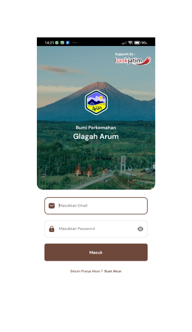
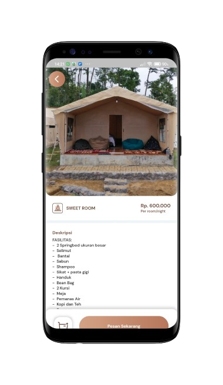

## Overview

<table class="table-auto text-left text-base min-w-full">
    <tbody>
      <tr class="border-b py-2">
        <th scope="row" class="font-bold">Client</th>
        <td class="font-bold">:</td>
        <td class="py-2">Fison Fahmi - Anggota Bumi Perkemahan Glagah Arum</td>
      </tr>
      <tr class="border-b py-2">
        <td class="font-bold">Duration</td>
        <td class="font-bold">:</td>
        <td class="py-2">9 Month</td>
      </tr>
      <tr class="border-b py-2">
        <td class="font-bold">Year</td>
        <td class="font-bold">:</td>
        <td class="py-2">2021-2022</td>
      </tr>
      <tr class="border-b py-2">
        <td class="font-bold">Services</td>
        <td class="font-bold">:</td>
        <td class="py-2">
          Mobile Development, UI/UX Design
          </td>
      </tr>
      <tr class="border-b py-2">
        <td class="font-bold">Platform</td>
        <td class="font-bold">:</td>
        <td class="py-2">
          Android
          </td>
      </tr>        
      <tr class="border-b py-2">
        <td class="font-bold">Tech Stacks</td>
        <td class="font-bold">:</td>
        <td class="py-2">
          Dart, Flutter, Laravel
          </td>
      </tr>        
    </tbody>
  </table>
  
[Bumi Glagah Arum](https://bumiglagaharum.com/) adalah tempat ideal untuk melepaskan penat dari keramaian kota. Nikmati suasana asri bersama keluarga, pasangan, kolega, atau sendirian untuk refleksi dan inspirasi.

Dengan pemandangan Gunung Semeru dan udara sejuk, Bumi Glagah Arum memadukan keindahan alam dan kemewahan. Tempat ini menawarkan glamping dengan tenda untuk 2 hingga 4 orang serta berbagai fasilitas, termasuk food court, area bermain anak, dan aktivitas outdoor yang seru.

Saya telah berkontribusi dalam pengembangan aplikasi mobile untuk Bumi Glagah Arum, mulai dari merancang ide, menyusun alur aplikasi, membuat UI/UX design hingga aplikasi dapat digunakan secara fungsional. 

Aplikasi ini dirancang untuk meningkatkan pengalaman pengguna di lokasi wisata dengan fitur-fitur utama yang melayani berbagai jenis pengguna yaitu:
1. Pemilik Kedai
- Pemilik Toko berwenang membuat dan mengelola produk, melihat hasil penjualan, menerima dan mengubah status pesanan, serta mencetak nota tagihan dengan Bluetooth
1. Pelayan / Waiter
- Pelayan dapat melihat status pesanan berdasarkan meja, membuat dan mengelola pesanan, serta menangani draft pesanan. 
1. Pengguna Biasa / Pengunjung
- Pengguna Biasa dapat menyewa glamping, tenda, peralatan berkemah, fasilitas outbound, dan area tertentu.

## Achievement

Aplikasi Bumi Glagah Arum telah didownload lebih dari 1,000 pengguna di Play Store dan berhasil mempermudah proses pelayanan di tempat pariwisata tersebut.


## Screenshots


  
  
  
  
  
  
  
  
  



## App Features:
Berikut penjabaran fitur-fitur berdasarkan peran pengguna:
### Pemilik Kedai
- **Description:** Pemilik kedai memiliki wewenang penuh atas pengelolaan produk dan penjualan pada Food Court.
- **Function:**
  - Membuat produk baru yang akan dijual di toko.
  - Melihat hasil penjualan produk untuk analisis dan pengambilan keputusan.
  - Menerima pesanan dari pelanggan dan mengelola status pesanan.
  - Mengubah status pesanan ketika siap untuk diambil atau diantar.
  - Mencetak nota tagihan menggunakan Bluetooth untuk kemudahan transaksi.
### Pelayan (Waiter)
- **Description:** Pelayan memiliki peran untuk mengelola pesanan dari pelanggan di area foodcourt.
- **Function:**
  - Melihat status pesanan berdasarkan meja pelanggan.
  - Melihat pesanan yang sudah siap untuk disajikan atau diantar.
  - Membuat pesanan baru dari pelanggan.
  - Mencari produk yang tersedia untuk memudahkan proses pemesanan.
  - Membuat draft pesanan untuk mengatur pesanan sebelum dikonfirmasi.
  - Mengedit draft pesanan jika ada perubahan dari pelanggan.
  - Menghapus draft pesanan jika pesanan dibatalkan atau tidak valid.
  
### Pengguna Biasa (Pengunjung)
- **Description:** Pengguna biasa adalah pengunjung yang ingin menikmati berbagai layanan dan fasilitas di Bumi Glagah Arum.
- **Function:**
  - Menyewa glamor camping (glamping) untuk pengalaman berkemah yang mewah.
  - Menyewa tenda untuk kebutuhan berkemah.
  - Menyewa peralatan berkemah untuk mendukung aktivitas berkemah.
  - Menyewa fasilitas outbound untuk kegiatan kelompok atau keluarga.
  - Menyewa area tertentu untuk berbagai keperluan seperti acara atau kegiatan khusus.
  

## 🔗 Link to Project

Live Demo
