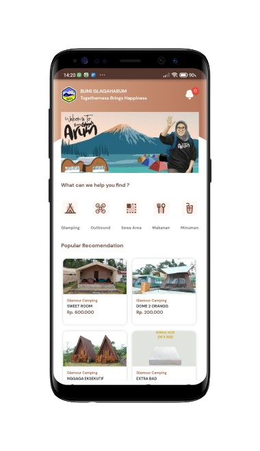
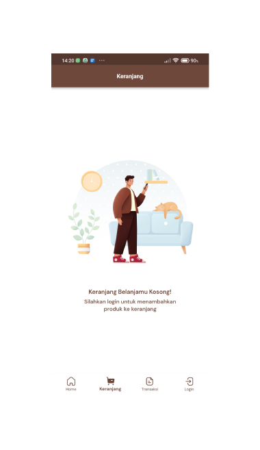
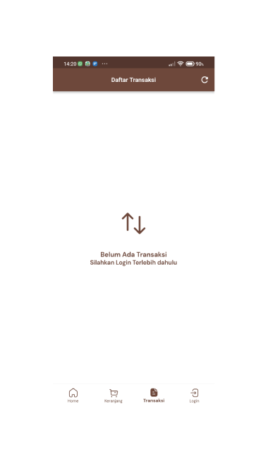
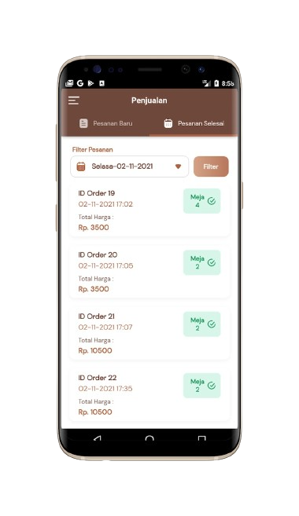

## Overview

<table class="table-auto text-left text-base min-w-full">
    <tbody>
      <tr class="border-b py-2">
        <th scope="row" class="font-bold">Client</th>
        <td class="font-bold">:</td>
        <td class="py-2">Fison Fahmi - Member Of Bumi Perkemahan Glagah Arum</td>
      </tr>
      <tr class="border-b py-2">
        <td class="font-bold">Duration</td>
        <td class="font-bold">:</td>
        <td class="py-2">9 Month</td>
      </tr>
      <tr class="border-b py-2">
        <td class="font-bold">Year</td>
        <td class="font-bold">:</td>
        <td class="py-2">2021-2022</td>
      </tr>
      <tr class="border-b py-2">
        <td class="font-bold">Services</td>
        <td class="font-bold">:</td>
        <td class="py-2">
          Mobile Development, UI/UX Design
          </td>
      </tr>
      <tr class="border-b py-2">
        <td class="font-bold">Platform</td>
        <td class="font-bold">:</td>
        <td class="py-2">
          Android
          </td>
      </tr>        
      <tr class="border-b py-2">
        <td class="font-bold">Tech Stacks</td>
        <td class="font-bold">:</td>
        <td class="py-2">
          Dart, Flutter, Laravel
          </td>
      </tr>        
    </tbody>
  </table>
  
[Bumi Glagah Arum](https://bumiglagaharum.com/) is an ideal place to unwind from the hustle and bustle of the city. Enjoy the serene atmosphere with your family, partner, colleagues, or alone for reflection and inspiration.
With the breathtaking view of Gunung Semeru and the cool air, Bumi Glagah Arum combines natural beauty and luxury. The site offers glamping with tents for 2 to 4 people, as well as various facilities, including a food court, children's play area, and exciting outdoor activities.

I have contributed to the development of a mobile application for Bumi Glagah Arum, starting from designing the concept, structuring the app flow, creating the UI/UX design, and ensuring the app functions properly.

This application is designed to enhance the user experience at the tourist location with key features catering to different types of users:
1. Shop Owners in Food Court
      - Create and manage products, view sales results, receive and update order status, and print invoices using Bluetooth.
Manage and update inventory, track sales, and handle customer orders.

1. Waiters
      - View order status by table, create and manage orders, and handle draft orders.

2. Regular Users / Visitors
      - Rent glamping, tents, camping equipment, outdoor facilities, and designated areas.

## Achievement

The Bumi Glagah Arum app has been downloaded by more than 1,000 users on the Play Store and has successfully streamlined the service process at the tourist site.


## Screenshots


  
  
  
  
  
  
  
  
  
  



## App Features:

### Shop Owner
- **Description:** The shop owner has full authority over the management of products and sales at the Food Court.
- **Function:**
  - Create new products to be sold in the store.
  - View sales results for analysis and decision-making.
  - Receive orders from customers and manage order status.
  - Update order status when ready for pickup or delivery.
  - Print invoices using Bluetooth for easier transactions.
  
### Waiter
- **Description:** The waiter is responsible for managing customer orders in the food court area.
- **Function:**
  - View order status based on customer tables.
  - View orders ready for serving or delivery.
  - Create new orders from customers.
  - Find available products to facilitate the ordering process.
  - Create draft orders to organize orders before confirmation.
  - Edit draft orders if there are changes from the customer.
  - Delete draft orders if the order is canceled or invalid.
  
### Regular User (Visitor)
- **Description:** Regular users are visitors who want to enjoy various services and facilities at Bumi Glagah Arum.
- **Function:**
  - Rent glamping for a luxurious camping experience.
  - Rent tents for camping needs.
  - Rent camping equipment to support camping activities.\
  - Rent outdoor facilities for group or family activities.
  - Rent specific areas for various needs such as events or special activities.
  

## 🔗 Link to Project

Live Demo
