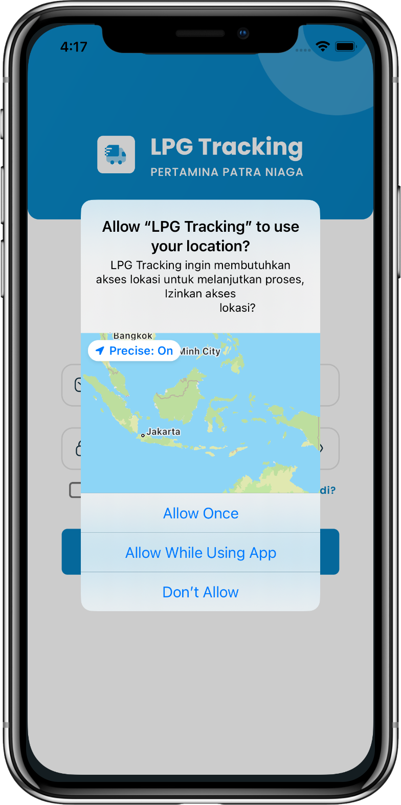
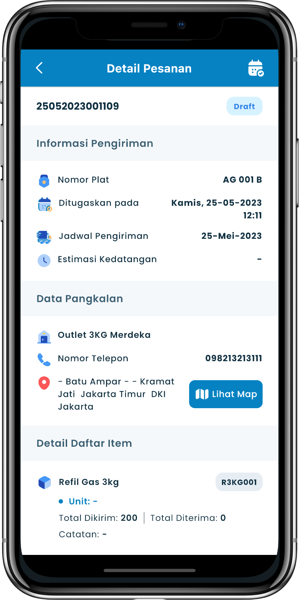
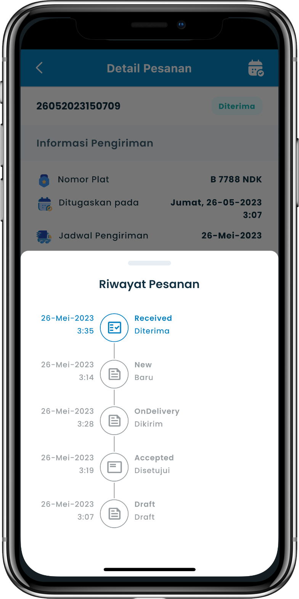

## Overview

<table class="table-auto text-left text-base min-w-full">
    <tbody>
      <tr class="border-b py-2">
        <th scope="row" class="font-bold">Client</th>
        <td class="font-bold">:</td>
        <td class="py-2">Mohammad Nadzif -  PT MyPro Solusindo Informatika </td>
      </tr>
      <tr class="border-b py-2">
        <td class="font-bold">Duration</td>
        <td class="font-bold">:</td>
        <td class="py-2">3 Month</td>
      </tr>
      <tr class="border-b py-2">
        <td class="font-bold">Year</td>
        <td class="font-bold">:</td>
        <td class="py-2">2023</td>
      </tr>
      <tr class="border-b py-2">
        <td class="font-bold">Services</td>
        <td class="font-bold">:</td>
        <td class="py-2">
          Mobile Development, UI/UX Design
          </td>
      </tr>
      <tr class="border-b py-2">
        <td class="font-bold">Platform</td>
        <td class="font-bold">:</td>
        <td class="py-2">
          Android & iOS
          </td>
      </tr>        
      <tr class="border-b py-2">
        <td class="font-bold">Tech Stacks</td>
        <td class="font-bold">:</td>
        <td class="py-2">
          Dart, Flutter
          </td>
      </tr>        
    </tbody>
  </table>

LPG Tracking adalah aplikasi pelacakan pengiriman tabung LPG milik Pertamina Patra Niaga. Client untuk proyek ini ialah Mohammad Nadzif - PT MyPro Solusindo Informatika sebagai vendor dari Pertamina Patra Niaga. 

Dalam proyek ini, PT MyPro Solusindo Informatika bertanggung jawab untuk menyediakan solusi teknologi yang dapat meningkatkan efisiensi dan transparansi dalam pelacakan dan pengiriman LPG. 

Saya berperan sebagai freelancer yang bekerja untuk PT MyPro Solusindo Informatika, bertindak sebagai pengembang utama untuk merancang UI/UX Design dan pengembangan aplikasi mobile.

Aplikasi ini dirancang untuk dua peran utama pengguna: 
- Transporter (🚚)
- Outlet (📦). 
   
Dengan fitur-fitur yang lengkap, aplikasi ini memudahkan proses pengelolaan dan pelacakan distribusi LPG, mulai dari pengelolaan pesanan hingga konfirmasi penerimaan barang. 

## Scope Tanggung Jawab
- Membuat UI/UX Design menggunakan **Figma** sesuai permintaan client.
- Mengembangkan standarisasi code dan project Flutter.
- Mengembangkan aplikasi hingga selesai.
  - termasuk translate UI design yang telah dibuat, 
  - mengintegrasikan dengan backend, 
  - menerapkan refresh token, 
  - serta menerapkan best practice Flutter.

## Screenshots


  
  
  
  
  
  
  


## App Features

1. **List Pesanan Pangkalan Dan Penjadwalan**: Fitur ini digunakan untuk mengelola semua pesanan yang terkait dengan pangkalan dan penjadwalan pengiriman. Ini adalah pusat kontrol utama untuk memastikan semua pesanan diatur dan dikelola dengan baik.

2. **Notifikasi ID Order Tergenerate**: Setiap kali ID Order baru dibuat, pengguna akan menerima notifikasi. Ini memastikan bahwa pengguna selalu diperbarui mengenai status pesanan baru yang telah terdaftar di sistem.

3. **View Detail Pesanan Pangkalan Dan Penjadwalan**: Fitur ini memberikan kemampuan bagi pengguna untuk melihat detail spesifik dari setiap pesanan dan jadwal yang terkait. Ini termasuk informasi seperti item yang dipesan, jadwal pengiriman, dan detail lainnya yang relevan.

4. **Search**: Fitur pencarian memudahkan pengguna untuk menemukan pesanan atau jadwal tertentu dengan cepat. Pengguna dapat memasukkan kata kunci atau kriteria lain untuk menyaring data yang dibutuhkan.

5.  **Filter Pesanan**: Selain pencarian, pengguna juga dapat menggunakan fitur filter untuk mempersempit daftar pesanan berdasarkan kriteria tertentu, seperti status, tanggal, atau jenis pesanan.

6.  **Konfirmasi Pengiriman Ya atau Tidak**: Fitur ini memungkinkan transporter untuk mengkonfirmasi apakah pengiriman telah dilakukan atau tidak. Ini adalah langkah penting untuk memastikan bahwa proses pengiriman telah selesai dan tercatat dengan benar dalam sistem.

7.  **Notifikasi Pengiriman**: Setelah pengiriman dilakukan, fitur ini akan mengirimkan notifikasi kepada pengguna terkait. Ini memberikan kepastian bahwa barang telah dikirim sesuai dengan pesanan.

8.  **Notifikasi Barang Telah Diterima Pangkalan (Agen)**: Fitur ini memberi tahu agen atau pangkalan bahwa barang yang dikirim telah diterima. Ini membantu mengurangi kebingungan atau ketidakpastian mengenai status pengiriman.

9.  **Update Status Pengiriman**: Pengguna dapat memperbarui status pengiriman barang melalui fitur ini. Ini memastikan bahwa semua informasi terkini mengenai pengiriman selalu tersedia dalam aplikasi.

10. **Konfirmasi Terima Barang**: Fitur ini memungkinkan pangkalan untuk mengkonfirmasi bahwa barang yang mereka terima sesuai dengan yang dikirim. Ini adalah langkah penting untuk mencatat penerimaan barang dengan akurat.

11. **Konfirmasi Realisasi Ya atau Tidak**: Fitur ini memungkinkan pengguna untuk melakukan konfirmasi apakah realisasi pengiriman telah dilakukan atau tidak, memberikan kepastian tambahan dalam proses pelacakan.

12. **Input Realisasi**: Pengguna dapat memasukkan data realisasi pengiriman melalui fitur ini, mencatat detail pengiriman yang telah dilakukan untuk keperluan administrasi dan pelaporan.

13. **Upload Foto**: Fitur ini memungkinkan pengguna untuk mengunggah foto sebagai bukti pengiriman. Ini dapat digunakan untuk mencatat kondisi barang saat dikirim atau diterima, menambah lapisan keamanan dan verifikasi.

14. **Validasi Geo Tagging Location**: Fitur ini digunakan untuk memvalidasi lokasi geografis (geo tagging) saat pengiriman barang dilakukan. Ini penting untuk memastikan bahwa pengiriman dilakukan di lokasi yang benar sesuai dengan pesanan.
