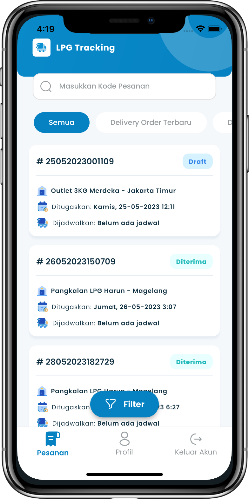

## Overview

<table class="table-auto text-left text-base min-w-full">
    <tbody>
      <tr class="border-b py-2">
        <th scope="row" class="font-bold">Client</th>
        <td class="font-bold">:</td>
        <td class="py-2">Mohammad Nadzif -  PT MyPro Solusindo Informatika </td>
      </tr>
      <tr class="border-b py-2">
        <td class="font-bold">Duration</td>
        <td class="font-bold">:</td>
        <td class="py-2">3 Month</td>
      </tr>
      <tr class="border-b py-2">
        <td class="font-bold">Year</td>
        <td class="font-bold">:</td>
        <td class="py-2">2023</td>
      </tr>
      <tr class="border-b py-2">
        <td class="font-bold">Services</td>
        <td class="font-bold">:</td>
        <td class="py-2">
          Mobile Development, UI/UX Design
          </td>
      </tr>
      <tr class="border-b py-2">
        <td class="font-bold">Platform</td>
        <td class="font-bold">:</td>
        <td class="py-2">
          Android & iOS
          </td>
      </tr>        
      <tr class="border-b py-2">
        <td class="font-bold">Tech Stacks</td>
        <td class="font-bold">:</td>
        <td class="py-2">
          Dart, Flutter
          </td>
      </tr>        
    </tbody>
  </table>

LPG Tracking adalah aplikasi pelacakan pengiriman tabung LPG milik Pertamina Patra Niaga. Client untuk proyek ini ialah Mohammad Nadzif - PT MyPro Solusindo Informatika sebagai vendor dari Pertamina Patra Niaga. 

Dalam proyek ini, PT MyPro Solusindo Informatika bertanggung jawab untuk menyediakan solusi teknologi yang dapat meningkatkan efisiensi dan transparansi dalam pelacakan dan pengiriman LPG. 

Saya berperan sebagai freelancer yang bekerja untuk PT MyPro Solusindo Informatika, bertindak sebagai pengembang utama untuk merancang UI/UX Design dan pengembangan aplikasi mobile.

Aplikasi ini dirancang untuk dua peran utama pengguna: 
- Transporter (🚚)
- Outlet (📦). 
   
Dengan fitur-fitur yang lengkap, aplikasi ini memudahkan proses pengelolaan dan pelacakan distribusi LPG, mulai dari pengelolaan pesanan hingga konfirmasi penerimaan barang. 

## Scope Tanggung Jawab:
- Membuat UI/UX Design menggunakan **Figma** sesuai permintaan client.
- Mengembangkan standarisasi code dan project Flutter.
- Mengembangkan aplikasi hingga selesai.
  - termasuk translate UI design yang telah dibuat, 
  - mengintegrasikan dengan backend, 
  - menerapkan refresh token, 
  - serta menerapkan best practice Flutter.

## Screenshots


  
  
  
  
  
  
  


## App Features:
