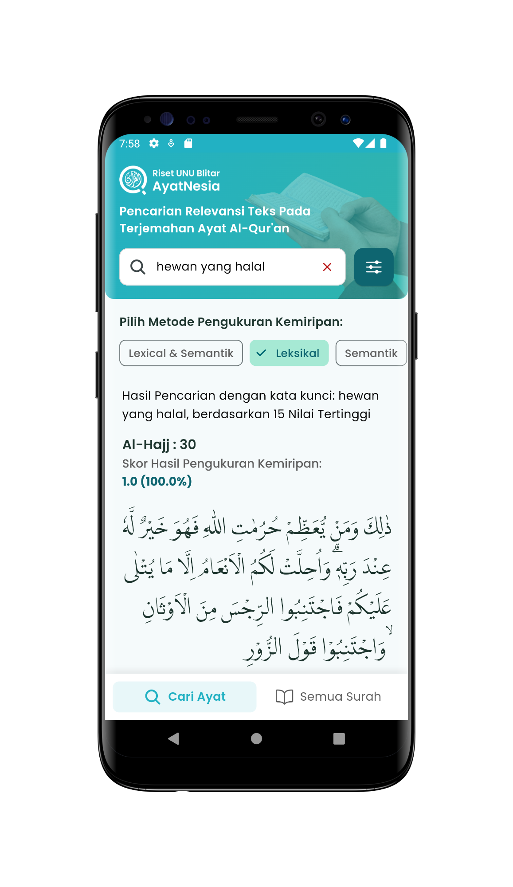
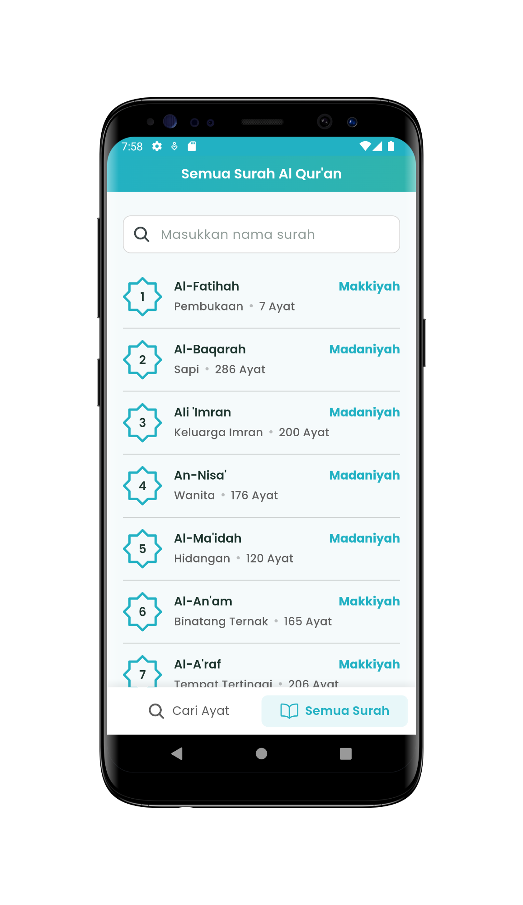

## Overview

<table class="table-auto text-left text-base min-w-full">
    <tbody>
      <tr class="border-b py-2">
        <th scope="row" class="font-bold">Tujuan:</th>
        <td class="font-bold">:</td>
        <td class="py-2">Tugas Akhir di Universitas Nahdlatul Ulama Blitar</td>
      </tr>
      <tr class="border-b py-2">
        <td class="font-bold">Durasi</td>
        <td class="font-bold">:</td>
        <td class="py-2">3 Bulan</td>
      </tr>
      <tr class="border-b py-2">
        <td class="font-bold">Tahun</td>
        <td class="font-bold">:</td>
        <td class="py-2">2023</td>
      </tr>
      <tr class="border-b py-2">
        <td class="font-bold">Platform</td>
        <td class="font-bold">:</td>
        <td class="py-2">
          Android, iOS, Web 
          </td>
      </tr>        
      <tr class="border-b py-2">
        <td class="font-bold">Tech Stacks</td>
        <td class="font-bold">:</td>
        <td class="py-2">
          Dart V3.16.9	& Flutter V3.2.6, HTML, CSS, JS, FastAPI, Python
          </td>
      </tr>        
    </tbody>
  </table>

**Flutter Ayatnesia Qur’an Search** adalah aplikasi mobile yang dikembangkan menggunakan Flutter, yang berfungsi sebagai proyek akhir saya untuk menyelesaikan **gelar Sarjana Ilmu Komputer di Universitas Nahdlatul Ulama, Blitar**.

Aplikasi ini memiliki fitur pencarian teks ayat-ayat Al-Qur’an dalam terjemahan bahasa Indonesia, yang memanfaatkan **pengukuran kemiripan leksikal dan semantik**.

Flutter Ayatnesia dirancang untuk memenuhi kebutuhan pengguna yang mencari ayat-ayat Al-Qur’an yang relevan, baik berdasarkan **kesamaan kata kunci maupun makna semantik,**

Dengan memanfaatkan dataset Al-Qur’an yang disediakan oleh Kementerian Agama Republik Indonesia (Kemenag).

Hal ini memudahkan masyarakat Indonesia untuk menemukan ayat-ayat yang paling sesuai dengan kebutuhan mereka.

Fitur pencarian dan pengelolaan data Al-Qur’an diintegrasikan melalui REST API yang saya kembangkan dalam proyek [“FastAPI Ayatnesia](https://github.com/utrodus/fastapi-ayatnesia).”

Dataset Al-Qur’an, yang mencakup teks Arab, terjemahan, dan tafsir singkat, diambil dari [Al-Qur’an Kemenag](https://quran.kemenag.go.id/), memastikan bahwa data yang digunakan valid dan dapat dipercaya.

**Prapemrosesan Data dan Penanganan Kuery**

Dataset dan kuery pencarian dalam aplikasi Flutter Ayatnesia Qur’an Search melalui serangkaian langkah prapemrosesan untuk meningkatkan akurasi dan relevansi pencarian. Langkah-langkah tersebut meliputi:

- **Case Folding:** Tahap ini mengubah semua karakter dalam teks menjadi huruf kecil dan menghilangkan tanda baca, memastikan keseragaman dalam pemrosesan teks.
  
- **Tokenisasi:** Teks dipecah menjadi bagian-bagian yang lebih kecil yang dikenal sebagai token atau kata, yang kemudian diproses secara individual.

- **Penghapusan Stopword:** Kata-kata umum yang tidak memberikan makna signifikan pada pencarian, seperti kata depan dan konjungsi, dihapus untuk memfokuskan pada istilah yang paling relevan.

- **Stemming:** Kata-kata dikembalikan ke bentuk dasar sesuai dengan struktur morfologi bahasa Indonesia. Ini melibatkan penghapusan semua imbuhan seperti prefiks, infiks, sufiks, dan konfiks, memastikan bahwa pencarian mempertimbangkan makna dasar dari kata-kata tersebut.

**Pengukuran Kemiripan**

- **Pengukuran Kemiripan Leksikal:** Aplikasi ini menggunakan **Term Frequency-Inverse Document Frequency (TF-IDF)** dan **Cosine Similarity** untuk mengukur kemiripan leksikal. TF-IDF mengevaluasi pentingnya sebuah kata dalam sebuah dokumen relatif terhadap seluruh dataset, sedangkan Cosine Similarity menghitung kosinus dari sudut antara dua vektor (yang mewakili dokumen atau kuery) untuk menentukan kemiripan mereka berdasarkan kemunculan kata.

- **Pengukuran Kemiripan Semantik:** Untuk menangkap makna semantik, aplikasi ini menggunakan **word embeddings** dengan model **FastText**. Pendekatan ini memungkinkan aplikasi memahami dan mengukur kemiripan makna antara kata-kata, bahkan jika kata-kata tersebut tidak identik secara leksikal, dengan merepresentasikan kata-kata dalam ruang vektor kontinu.

## Screenshots
### Mobile App

  
  
  
  
  
  
  
  
  
  
  
  


### Web App

### API Documentation

## Preview
### Mobile App


### Web App


## App Features:

### Pencarian Teks Al-Qur'an yang Canggih
Aplikasi ini memungkinkan pengguna untuk mencari ayat-ayat Al-Qur'an dalam terjemahan bahasa Indonesia dengan menggunakan kemiripan leksikal dan semantik, membantu pengguna menemukan ayat yang paling relevan berdasarkan kata kunci atau makna.

### Pencarian Leksikal
Aplikasi ini memiliki kemampuan pencarian yang memanfaatkan kemiripan leksikal, memastikan bahwa ayat-ayat dengan kata kunci serupa dapat diidentifikasi dan ditampilkan secara akurat kepada pengguna.

### Pencarian Semantik
Fitur pencarian ini melampaui pencocokan kata kunci dengan memahami makna semantik, memungkinkan pencarian yang lebih mendalam dan relevan.

### Integrasi REST API
Aplikasi ini terintegrasi dengan REST API yang dikembangkan menggunakan FastAPI Ayatnesia untuk mengelola data Al-Qur'an, memastikan kinerja pencarian yang cepat dan efisien.

### Sumber Data yang Terpercaya
Dengan memanfaatkan dataset Al-Qur'an dari Kementerian Agama Republik Indonesia (Kemenag), termasuk teks Arab, terjemahan bahasa Indonesia, dan tafsir singkat, aplikasi ini menjamin akurasi dan keandalan data.

 
## Link to Project
### Mobile App


### RestAPI & Web
