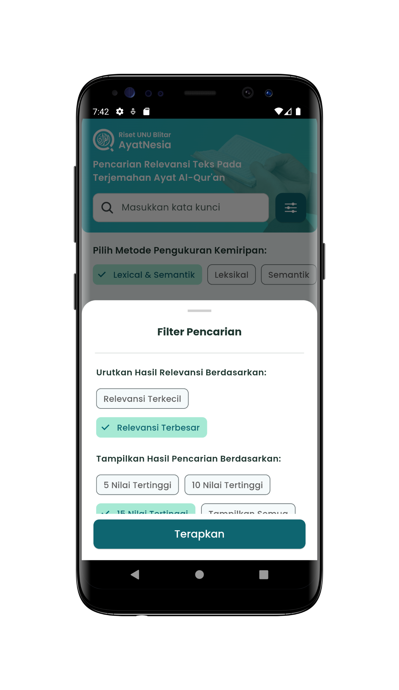
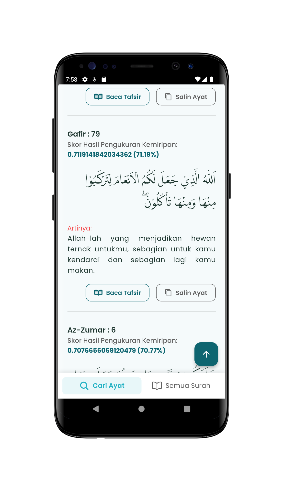

## Overview

<table class="table-auto text-left text-base min-w-full">
    <tbody>
      <tr class="border-b py-2">
        <th scope="row" class="font-bold">Purpose:</th>
        <td class="font-bold">:</td>
        <td class="py-2">Final Year Project in Nahdlatul Ulama University Of Blitar</td>
      </tr>
      <tr class="border-b py-2">
        <td class="font-bold">Duration</td>
        <td class="font-bold">:</td>
        <td class="py-2">3 Month</td>
      </tr>
      <tr class="border-b py-2">
        <td class="font-bold">Year</td>
        <td class="font-bold">:</td>
        <td class="py-2">2023</td>
      </tr>
      <tr class="border-b py-2">
        <td class="font-bold">Platform</td>
        <td class="font-bold">:</td>
        <td class="py-2">
          Android | iOS | Web 
          </td>
      </tr>        
      <tr class="border-b py-2">
        <td class="font-bold">Tech Stacks</td>
        <td class="font-bold">:</td>
        <td class="py-2">
          Dart V3.16.9	& Flutter V3.2.6, HTML, CSS, JS, FastAPI, Python
          </td>
      </tr>        
    </tbody>
  </table>

**Flutter Ayatnesia Qur'an Search** is a mobile application developed using Flutter, which serves as my final project for completing a **Computer Science degree at Nahdlatul Ulama University, Blitar**.

This application features a search capability for the text of Qur'anic verses in Indonesian translation, **utilizing both lexical and semantic similarity measurements.**

Flutter Ayatnesia is designed to meet the needs of users looking for relevant Qur'anic verses, whether based on keyword similarity or semantic meaning, 

By leveraging the Al-Qur'an dataset provided by the Indonesian Ministry of Religious Affairs (Kemenag). 

This makes it easier for the Indonesian public to find verses that best match their needs.

The search feature and Qur'anic data management are integrated through a REST API that I developed in the project "[FastAPI Ayatnesia](https://github.com/utrodus/fastapi-ayatnesia)." 

The Qur'an dataset, which includes Arabic text, translations, and brief interpretations, is sourced from the [Al Qur'an Kemenag](https://quran.kemenag.go.id/), ensuring that the data is valid and reliable.

**Data Preprocessing and Query Handling**

The dataset and search queries in the Flutter Ayatnesia Qur'an Search app undergo a series of preprocessing steps to enhance search accuracy and relevance. These steps include:

1. **Case Folding**: This stage converts all characters in the text to lowercase and removes punctuation marks, ensuring uniformity in the text processing.

2. **Tokenization**: The text is broken down into smaller parts known as tokens or words, which are then individually processed.

3. **Stopword Removal**: Commonly used words that do not contribute significant meaning to the search, such as prepositions and conjunctions, are removed to focus on the most relevant terms.

4. **Stemming**: Words are reduced to their root form according to the morphological structure of the Indonesian language. This involves removing all affixes, such as prefixes, infixes, suffixes, and confixes, ensuring that the search considers the base meaning of the words.

**Similarity Measurements**

1. **Lexical Similarity Measurement**: The app uses **Term Frequency-Inverse Document Frequency (TF-IDF)** and **Cosine Similarity** to measure lexical similarity. TF-IDF evaluates the importance of a word in a document relative to the entire dataset, while Cosine Similarity calculates the cosine of the angle between two vectors (representing documents or queries) to determine their similarity based on word occurrence.

2. **Semantic Similarity Measurement**: To capture semantic meaning, the app employs **word embeddings** using the **FastText model**. This approach allows the app to understand and measure the similarity in meaning between words, even if they are not lexically identical, by representing words in a continuous vector space.

## Screenshots
### Mobile App

  
  
  
  
  
  
  
  
  
  
  
  


### Web App

### API Documentation

## Preview
### Mobile App


### Web App


## App Features:
### Advanced Qur'anic Text Search
The app allows users to search for Qur'anic verses in Indonesian translations using both lexical and semantic similarity, helping users find the most relevant verses based on keywords or meaning.
### Lexical Search
The app features a search capability that leverages lexical similarity, ensuring that verses with similar keywords are accurately identified and presented to the user.
### Semantic Search
The search feature goes beyond keyword matching by understanding semantic meaning, enabling deeper and more relevant searches.
### Integrated REST API
The app is integrated with a REST API developed using FastAPI Ayatnesia for managing Qur'anic data, ensuring fast and efficient search performance.
### Reliable Data Source
Utilizing the Qur'an dataset from the Indonesian Ministry of Religious Affairs (Kemenag), including Arabic text, Indonesian translations, and brief interpretations, guarantees data accuracy and reliability.

 
## Link to Project
### Mobile App


### RestAPI & Web
