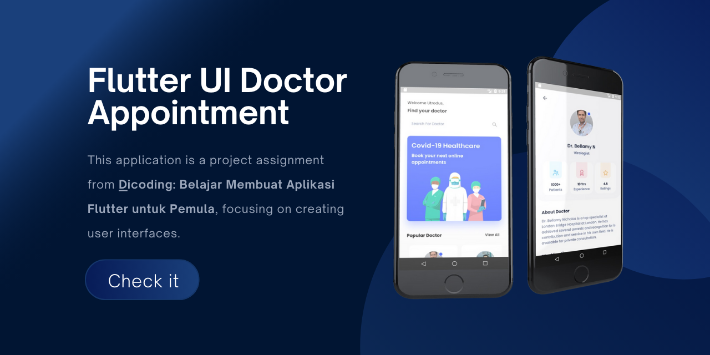

## Overview

<table class="table-auto text-left text-base min-w-full">
    <tbody>
      <tr class="border-b py-2">
        <th scope="row" class="font-bold">Purpose:</th>
        <td class="font-bold">:</td>
        <td class="py-2">Dicoding Submission</td>
      </tr>
      <tr class="border-b py-2">
        <td class="font-bold">Duration</td>
        <td class="font-bold">:</td>
        <td class="py-2">9 Days</td>
      </tr>
      <tr class="border-b py-2">
        <td class="font-bold">Year</td>
        <td class="font-bold">:</td>
        <td class="py-2">2021</td>
      </tr>
      <tr class="border-b py-2">
        <td class="font-bold">Platform</td>
        <td class="font-bold">:</td>
        <td class="py-2">
          Android & iOS
          </td>
      </tr>        
      <tr class="border-b py-2">
        <td class="font-bold">Tech Stacks</td>
        <td class="font-bold">:</td>
        <td class="py-2">
          Dart V2.13.1, Flutter V2.2.1
          </td>
      </tr>        
    </tbody>
  </table>

Flutter Doctor Appointments is a UI application built with Flutter, specifically designed to facilitate the search for and booking of doctor appointments. This application is a project assignment from [Dicoding: Learn to Make Flutter Apps for Beginners](https://www.dicoding.com/academies/159), focusing on creating user interfaces.

## Preview

## App Features:
### Doctor Search
- **Description:** Provides a search interface for doctors based on name.
- **Function:** Offers an intuitive user experience for finding relevant doctors within the UI application.

### Responsive
- **Description:** Uses media queries to adjust the layout of the application to fit various screen sizes.
- **Function:** Ensures that the UI application displays well across different devices, from smartphones to tablets.
  
### Custom Flutter Widgets
- **Description:** Utilizes custom widgets for tailored UI elements.
- **Function:** Creates a unique and engaging user interface by customizing widgets according to design requirements.
  
### Loading Local Data from JSON
- **Description:** Although this application focuses solely on the UI, doctor data is retrieved from a local JSON file for demonstration purposes.
- **Function:** Allows the display of static doctor data without the need for a server or external API.

## Certificate  


Show credential


 
## Link to Project


