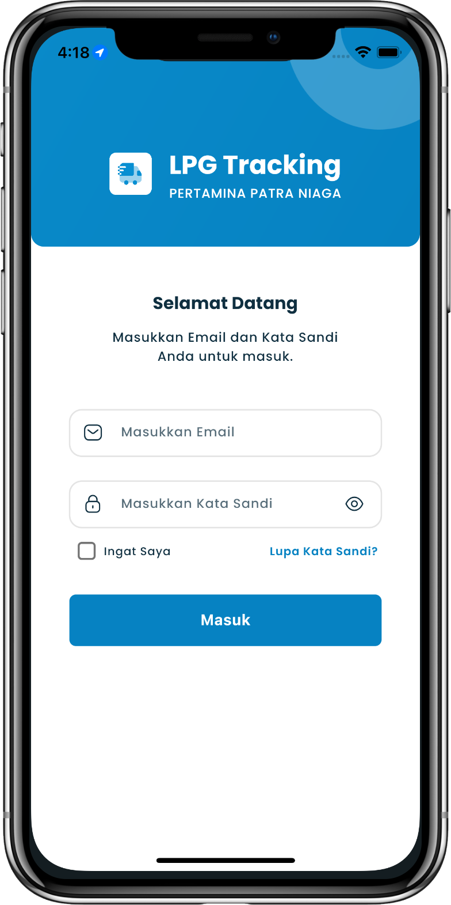

## Overview

<table class="table-auto text-left text-base min-w-full">
    <tbody>
      <tr class="border-b py-2">
        <th scope="row" class="font-bold">Client</th>
        <td class="font-bold">:</td>
        <td class="py-2">Mohammad Nadzif -  PT MyPro Solusindo Informatika </td>
      </tr>
      <tr class="border-b py-2">
        <td class="font-bold">Duration</td>
        <td class="font-bold">:</td>
        <td class="py-2">3 Month</td>
      </tr>
      <tr class="border-b py-2">
        <td class="font-bold">Year</td>
        <td class="font-bold">:</td>
        <td class="py-2">2023</td>
      </tr>
      <tr class="border-b py-2">
        <td class="font-bold">Services</td>
        <td class="font-bold">:</td>
        <td class="py-2">
          Mobile Development, UI/UX Design
          </td>
      </tr>
      <tr class="border-b py-2">
        <td class="font-bold">Platform</td>
        <td class="font-bold">:</td>
        <td class="py-2">
          Android & iOS
          </td>
      </tr>        
      <tr class="border-b py-2">
        <td class="font-bold">Tech Stacks</td>
        <td class="font-bold">:</td>
        <td class="py-2">
          Dart, Flutter
          </td>
      </tr>        
    </tbody>
  </table>

LPG Tracking is a mobile app for tracking application for LPG cylinder deliveries owned by Pertamina Patra Niaga. The client for this project is Mohammad Nadzif - PT MyPro Solusindo Informatika, acting as a vendor for Pertamina Patra Niaga.

In this project, PT MyPro Solusindo Informatika was responsible for providing technology solutions to improve efficiency and transparency in LPG tracking and delivery.

I worked as a freelancer for PT MyPro Solusindo Informatika, acting as the lead developer for designing the UI/UX and developing the mobile application.

The application is designed for two primary user roles:

Transporter (🚚)
Outlet (📦)
With comprehensive features, this application facilitates the management and tracking of LPG distribution processes, from order management to goods receipt confirmation.

## Scope of Responsibilities
- Creating UI/UX Design using **Figma** according to the client's request.
- Developing standardization for code and Flutter project.
- Developing the application to completion.
  - This includes translating the designed UI,
  - integrating it with the backend,
  - implementing refresh token,
  - and applying Flutter best practices.

## Screenshots

  
  
  
  
  
  
  


## App Features

- **List of Orders and Scheduling**: This feature is used to manage all orders related to the outlet and delivery scheduling. It serves as the main control hub to ensure that all orders are properly organized and managed.

- **Generated Order ID Notification**: Every time a new Order ID is created, users will receive a notification. This ensures that users are always updated about the status of new orders registered in the system.

- **View Order and Scheduling Details**: This feature allows users to view specific details of each order and its associated schedule. It includes information such as ordered items, delivery schedule, and other relevant details.

- **Search**: The search feature makes it easy for users to quickly find specific orders or schedules. Users can input keywords or other criteria to filter the required data.

- **Order Filter**: In addition to the search feature, users can use the filter feature to narrow down the order list based on certain criteria, such as status, date, or order type.

- **Delivery Confirmation (Yes or No)**: This feature allows the transporter to confirm whether the delivery has been completed or not. This is a crucial step to ensure that the delivery process is completed and properly recorded in the system.

- **Delivery Notification**: Once the delivery is completed, this feature will send a notification to the relevant users. This ensures that the goods have been delivered as ordered.

- **Goods Received Notification at the Outlet (Agent)**: This feature informs the agent or outlet that the delivered goods have been received. This helps reduce confusion or uncertainty about the delivery status.

- **Update Delivery Status**: Users can update the delivery status through this feature. This ensures that the most up-to-date information about deliveries is always available in the application.

- **Goods Receipt Confirmation**: This feature allows the outlet to confirm that the goods they received match the ones shipped. It is an important step in accurately recording the receipt of goods.

- **Delivery Realization Confirmation (Yes or No)**: This feature allows users to confirm whether the delivery realization has been completed or not, providing additional assurance in the tracking process.

- **Input Delivery Realization**: Users can input delivery realization data through this feature, recording the details of completed deliveries for administrative and reporting purposes.

- **Photo Upload**: This feature allows users to upload photos as proof of delivery. It can be used to document the condition of goods during shipment or receipt, adding a layer of security and verification.

- **Geo-Tagging Location Validation**: This feature is used to validate the geographical location (geo-tagging) when goods are delivered. It is important to ensure that the delivery is made to the correct location according to the order.
