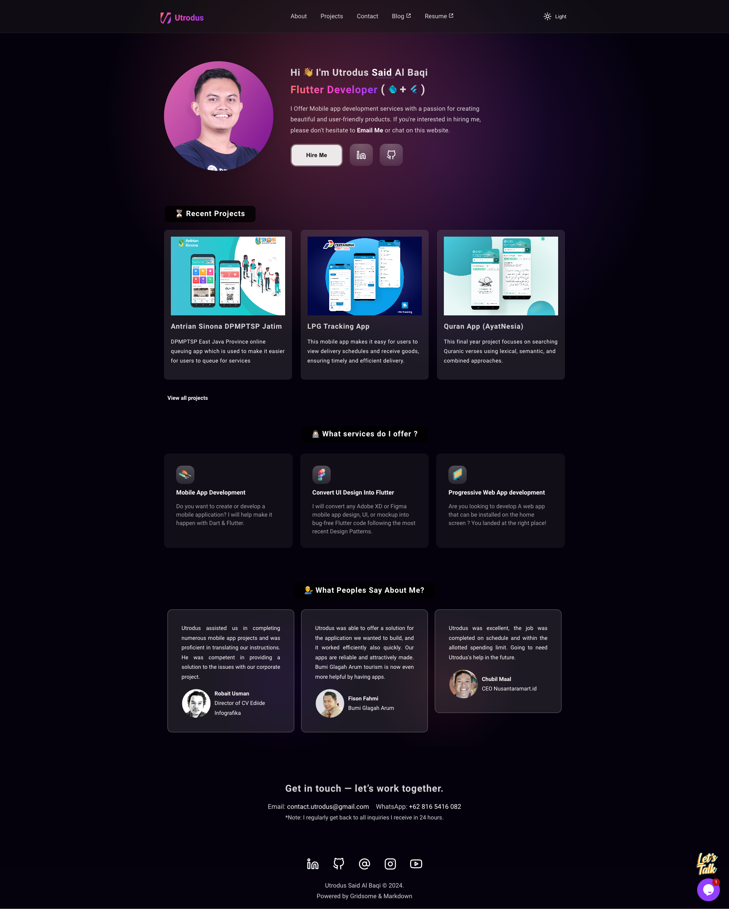
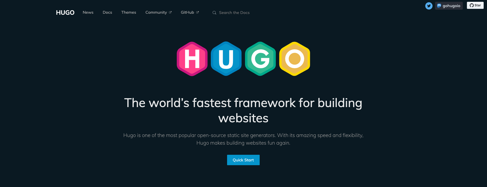

Hi 👋🏻, I’m Utrodus Said Al Baqi, A **software engineer** proficient in **Flutter** for cross-platform application development. 

If you’ve visited [utrodus.com](https://utrodus.com), you may have noticed some significant changes. I recently migrated my portfolio site from **[Gridsome](https://gridsome.org/)** to **[Hugo](https://gohugo.io/)**, a decision driven by both practical and technical needs.

Originally, my site was built with **Gridsome**, a Vue.js-powered static site generator. It served me well for showcasing my projects, but as my portfolio grew and I wanted to add a blog, maintaining the Gridsome project became increasingly cumbersome. 

This is my old portfolio site built with gridsome:

Here, I’ll break down why I chose **Hugo**, how I managed the migration, and why Hugo offers a superior solution for developers seeking performance, simplicity, and scalability.

### Why Move Away from Gridsome?

Gridsome is an excellent tool for static sites, especially if you're already familiar with the `Vue.js` ecosystem. However, as I expanded my portfolio site to include a blog, I encountered several limitations:

1. **Complexity**: Managing content became increasingly challenging, particularly for creating blog posts. The Vue-based architecture meant that even minor content updates often required codebase changes, complicating what should be a simple task.
   
2. **Performance**: While Gridsome is relatively fast, as the project grew, so did the build times. I wanted a static site generator that could handle larger content scales with improved speed and efficiency.

3. **Maintenance**: Keeping up with Gridsome's dependencies and structure demanded more attention than I anticipated. This led me to seek a solution that was easier to maintain.

### Why Hugo?

After exploring various static site generators, such as **Jekyll**, **Gatsby**, and **Hugo**, it became clear that **Hugo** was the best option for my needs. Here's why:

1. **Unmatched Speed**: **[Hugo](https://gohugo.io/)** is written in Go, making it one of the fastest static site generators. Build times, even with numerous pages and blog posts, are practically instantaneous.
   
2. **Simple Content Management**: Hugo handles content through simple **Markdown** files. I no longer need to wrestle with complex Vue.js components or GraphQL queries just to write a blog post.
   
3. **Ease of Maintenance**: With Hugo, maintenance is drastically reduced. It doesn’t have nearly as many dependencies, making it far easier to manage in the long run.

4. **Blowfish Theme**: I discovered the **[Blowfish](https://blowfish.page/)** theme by [Nuno Coração](https://n9o.xyz/), which fits my needs perfectly. Its minimalist design and developer-friendly features make it ideal for showcasing a portfolio and managing blog content.

### Migration Process: From Gridsome to Hugo

Migrating my portfolio from Gridsome to Hugo involved several key steps:

#### 1. **Content Migration**:
   Hugo uses a folder-based content organization. This meant that I needed to convert my existing content into Markdown files and add appropriate front matter. This process was straightforward compared to the more complex data-fetching logic in Gridsome.

#### 2. **Templates and Layouts**:
   Hugo’s templating system is built on **Go templates**, which are simple yet powerful. Unlike Gridsome’s Vue components, Hugo allows you to manage layouts through plain HTML files, offering greater flexibility without needing to manage JavaScript-heavy dependencies.

#### 3. **Deployment**:
   I host my portfolio on [**Netlify**](https://www.netlify.com/), automating my build and deployment process was incredibly simple. Every time I push changes to the main branch, Hugo builds the site, and Netlify handles the rest.

### Why Blowfish?

The **[Blowfish](https://blowfish.page/)** theme was a key factor in my switch to Hugo. It offers a clean, minimal aesthetic that puts the focus on content without unnecessary distractions. Here’s why Blowfish stood out:

- **Ease of Customization**: Blowfish is designed to be extremely developer-friendly. It’s easy to modify and extend, which allowed me to customize the layout to perfectly fit my portfolio’s needs.
- **Responsive Design**: The theme is fully responsive, ensuring that my site looks great across all devices.
- **Content Management**: With Hugo and Blowfish, managing blog posts is as simple as writing Markdown files and placing them in the correct directory. No more messing around with Vue components or GraphQL queries like I had to with Gridsome.

For detailed instructions on installing and configuring the Blowfish theme, check out the official documentation:  **[Blowfish Installation Guide](https://blowfish.page/docs/installation/)**.

### Final Thoughts

Switching from **[Gridsome](https://gridsome.org/)** to **[Hugo](https://gohugo.io/)** has been a game-changer for my portfolio. It’s faster, simpler to maintain, and offers an easy-to-use content management system that fits my workflow perfectly.

The **[Blowfish](https://blowfish.page/)** theme, in particular, has made creating a stylish, professional portfolio and blog incredibly easy. If you’re looking to streamline your site, I highly recommend checking out Hugo and Blowfish.

I’m excited to continue expanding my portfolio and sharing more content without the overhead of maintaining complex setups. You can always find the latest updates on my site at [utrodus.com](https://utrodus.com).

If you’d like to see the source code for my portfolio:

***Built with Gridsome:***



***Built with Hugo & Blowfish Theme:***



---
